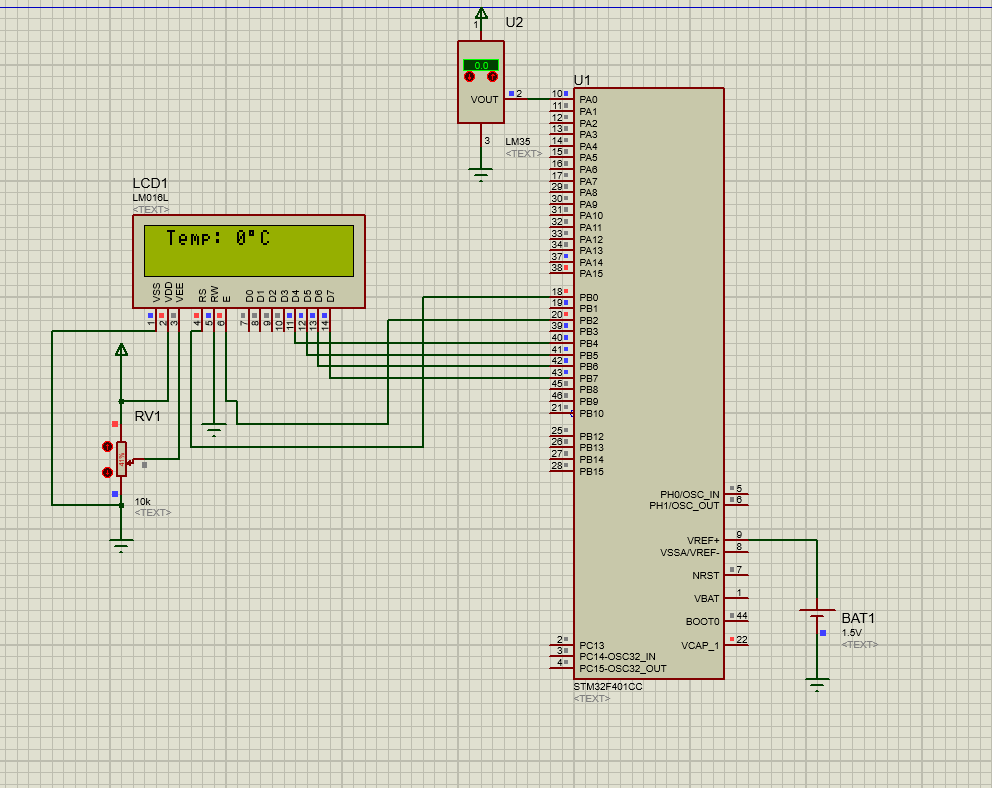
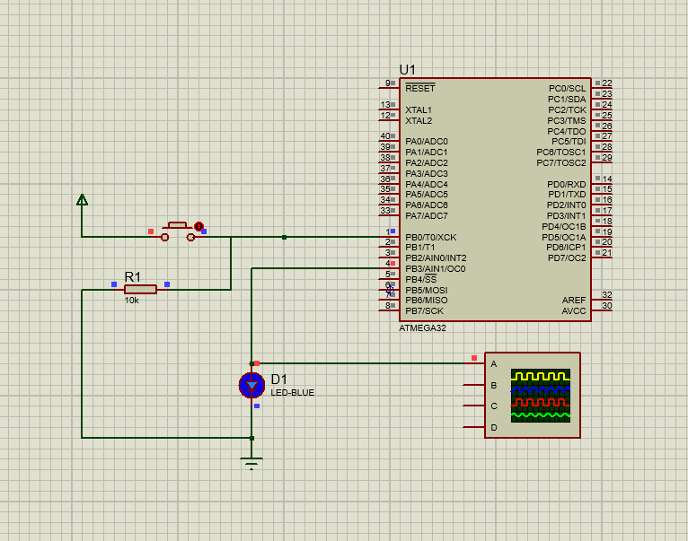
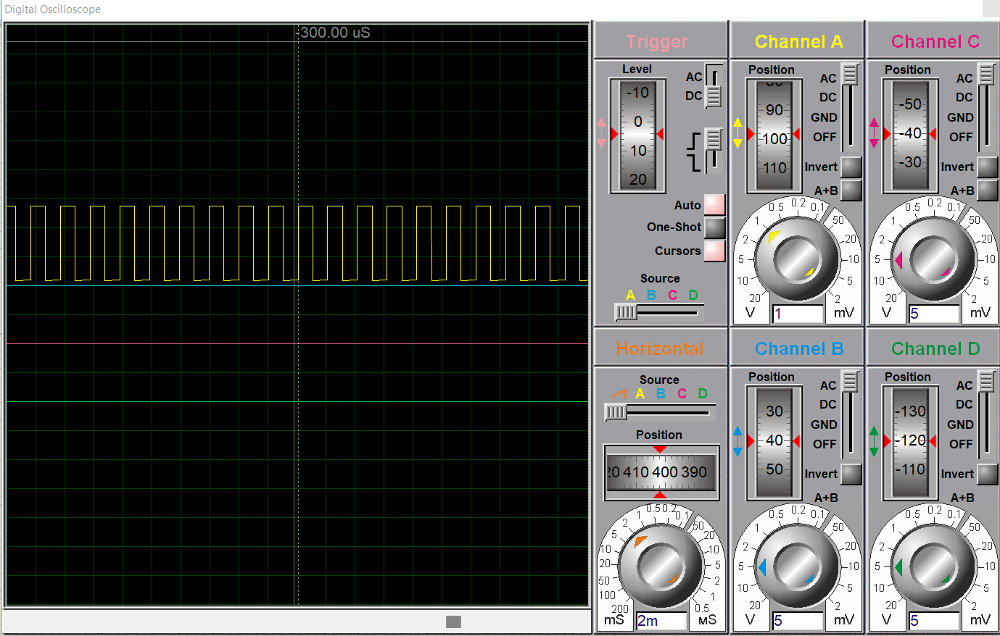
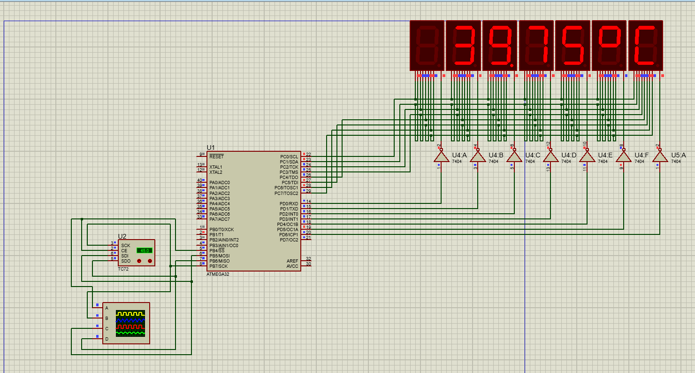
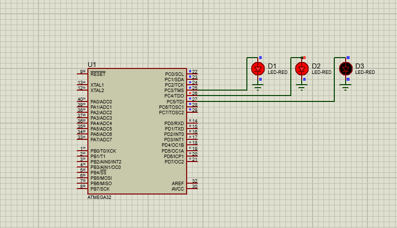

# Embedded-C-Tasks
Some projects/tasks taken in Embbedded C and Advanced Embedded C course - on compus

## Covered topics:
- C / Embedded C
- proteus
- GPIO - General Purpose Input Output
- SPI - Serial Peripheral Interface
- I2C - Inter-Integrated Circuit
- STM32 - ARM Cortex M4
- AVR - ATmega32
- RTOS - FreeRTOS
- Design Patterns
  - proxy 
  - observer 
  - polling
- SOLID principles
### Task 1: Analog to Digital Converter (ADC) for Temperature Sensor
- ADC in STM32

### Task 2: Pulse Width Modulation (PWM)
- Pulse Width Modulation (PWM) in STM32

- PWM in Oscilloscope

### Task 3: Applying Polling Pattern to Temperature Sensor reading
- SPI in AVR
- Polling Pattern
  - periodic
  - opportunistic

### Task 4: Real Time Operating System (RTOS)
- FreeRTOS 
- Timers using LEDs as Ticks

